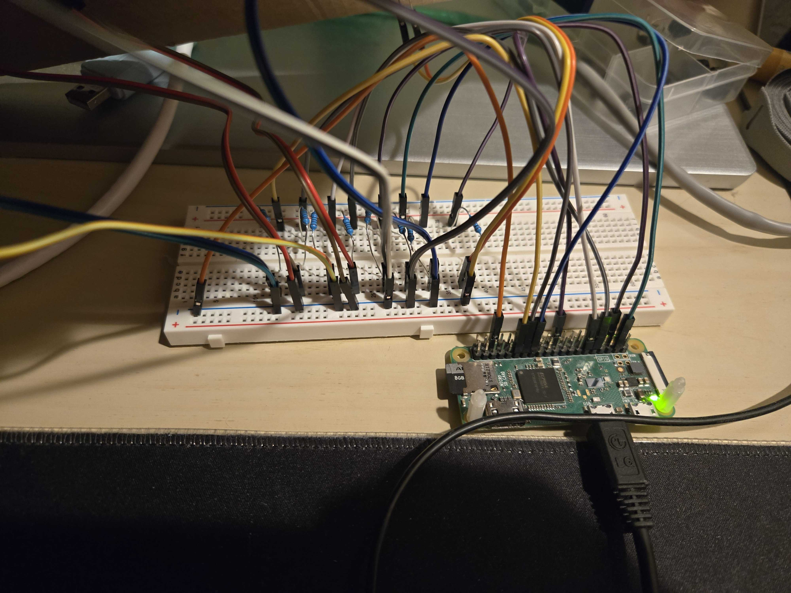

# McBrokenLights
A real life map of McDonald's ice cream machine statuses taking advantage of the [McBroken](https://mcbroken.com) API and Raspberry Pi GPIO pins
# Requirements

* Raspberry Pi with GPIO pins
* Red and Green LEDs
* A printed map
# How to run
Download [main.py](main.py) and [config.json](config.json). Install packages in [requirements.txt](requirements.txt).

Using [McBroken](https://mcbroken.com), copy the street addresses of the McDonalds locations you would like to track and add them to `addresses` in `config.json`. In the same order the addresses were added, add the corresponding GPIO pin numbers for each red LED (in the `gpioBroken` array) and the green LED (in the `gpioWorking` array).

For example:
```
  "gpioBroken": [17, 5, 16, 22],
  "gpioWorking": [27, 6, 26, 25],
  "addresses": ["6003 West Vernor Highway", "6876 Michigan Ave", "4235 Woodward Avenue", "2889 W Grand Blvd"]
```

For the McDonald's at `6003 West Vernor Highway`, when the ice cream machine is working, it will power the LED at GPIO 27, whereas when it is broken it will power the LED on GPIO17.